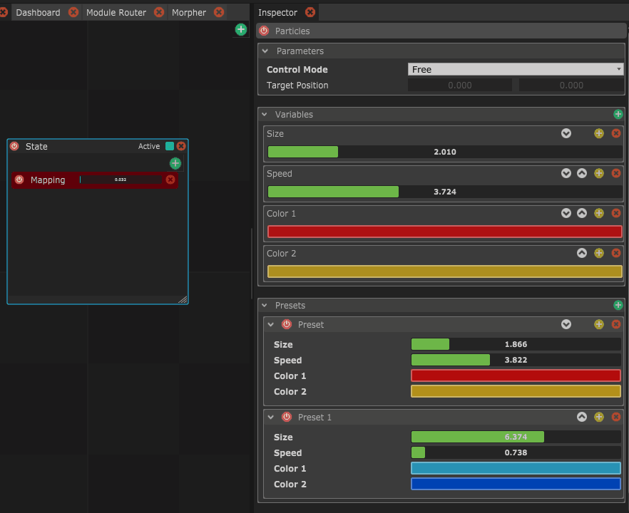

# Example 2 : Particle system presets

Une autre utilisation des variables personnalisées consiste à stocker différentes valeurs prédéfinies.

Imaginons que vous ayez un système de particules réalisé en Unity ou Processing, ou une vidéo de particules en Resolume ou MadMapper. Votre système est contrôlé par OSC, vous pouvez donc envoyer plusieurs valeurs OSC pour en changer le style.

Les variables personnalisées peuvent vous aider à créer des ensembles de paramètres que vous souhaitez conserver et envoyer

Une fois que vous avez différents préréglages, vous pouvez commencer à les interpoler avec les commandes du module spécial

Voici le résultat dans la vue des variables personnalisées

