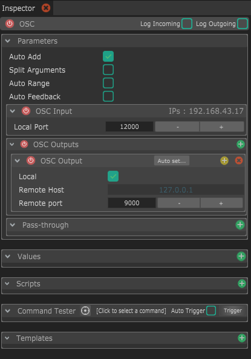

# Les Modules

Les modules représentent tous les autres logiciels et périphériques avec lesquels tu vas intéragir dans Chataigne.

Ils sont divisés en plusieurs catégories représentant les différents types d'interface. Chataigne propose à la fois des modules dédiés à certains logiciels et périphériques préconfigurés pour faciliter le contrôle de ceux-ci, mais également des modules génériques pour permettre de contrôler tout le reste.

## Anatomie d'un Module

### En-tête

A la sélection d'un module, tu peux trouver tout en haut dans l'Inspector un en-tête avec quelques controls. Tu peux par exemple activer / désactiver le module.  
Quand le module est désactivé, il ne se mettra pas à jour avec des nouvelles données, et n'enverra aucune donnée non plus.  
En fonction de la capacité du module à recevoir et / ou envoyer des données, tu peux choisir d'activer le log des données entrantes et / ou sortantes avec les boutons **Log Incoming / Log Outgoing**. Si ils sont activés, tu pourras vérifier dans le panneau Logger les données transitants dans ce module..

### Parameters

Cette section fournir tous les paramètres nécessaires à la configuration du module, comme les ports et IP de connection, ou alors le périphérique MIDI sur lequel se connecter, etc. Tu peux trouver plus d'infos sur les paramètres de chaque module dans leur page dédiée.

### Values

C'est une importante partie du module. Les Values sont les données que tu pourras utiliser pour créer des intéractions. Chaque module possède son propre set de values, d'autres comme le module OSC se remplissent au fur et à mesure de la réception de données, et d'autres non rien car ils ne peuvent pas recevoir.

### Scripts

Les scripts te permettront de créer des logiques plus complexes. Tu peux trouver plus d'infos dans la section [Scripts](../scripting/introduction-to-scripts.md).

### Command Tester

The command tester est un outil pratique pour tester les commandes que le module permet, ou juste d'envoyer une command manuellement rapidement. Il n'affecte pas le reste du logiciel, et peut être utilisé juste pour vérifier que la communication entre Chataigne et un autre logiciel ou matériel marche correctement.


Pour tester des commandes, choisis d'abord la commande à tester et ensuite appuies sur le bouton "**Trigger**" pour envoyer la command. Si tu veux envoyer une commande à chaque fois qu'un paramètre de cette command a channgé, tu peux activer l'option "**Auto trigger**".


### Templates

Les templates sont un bon moyen de personnaliser un module pour un usage spécifique sans avoir à créer son propre "Custom Module".  
Tu peux dans cette section créer tes propres commandes, en créant un template de la commande de base à personnaliser. Ensuite tu peux changer les paramètres, choisir quels champs seront éditables, et des comportements par défaut pour les mappings.

