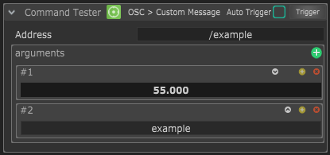
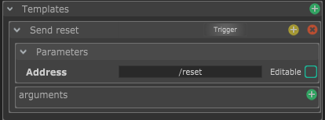

# The Modules

The modules are representing all the other softwares and devices you will interact with in your project.

They are divided in main categories representing different types of interfaces. Chataigne provides both dedicated modules for supported softwares and devices with preconfigured control for ease of use, and general modules for allowing control of anything else.

## Anatomy of a Module

### Header

When selecting a module, you can find at the very top a header with some controls. You can here choose to enable/disable the module.   
When a module is disabled, it will not update or send anything.   
Depending on whether the module is able to receive and/or send data, you can choose to activate/deactivate the logging of all data received and/or sent from this module with the **Log Incoming / Log Outgoing** buttons. If enabled, you'll be able to check in the Logger panel what's going on with this module.

### Parameters

This section provides all the needed parameters to configure the modules, such as Host and port configuration for network modules, or device name for MIDI controllers, etc. You can find more about a particular module's parameter in its dedicated page.

### Values

This is an important part of the module. The values are all the elements that you will be able to use when creating interactions. Each module has its own set of values, and some modules don't have any if they're not supposed to receive anything or if the Input parameter is deactivated \(for network module for instance\).

### Scripts

The script section allows you to create more complex logic for this module. You can find more about scripts in the dedicated [Scripts ](../scripting/untitled.md)page.

### Command Tester

The command tester is a handy tool to be able to test the functionality of your module by sending commands manually. It is not affecting the rest of the software, and allows you to just verify that the communication between Chataigne and your software or device is functioning properly.


When testing commands, first set your parameters and then hit the "Trigger" buttons. If you want to send the command every time a parameter of this command has changed, you can check the **"Auto Trigger"** option.


### Templates

The templates are a good way to customize a module for a specific use without having to create your own custom module.  
You can create your own custom commands, by creating a new Template and choosing a base command to derive from. Then you can customize it, and choose which fields are editable, which are not, and setup default mapping behaviors.

