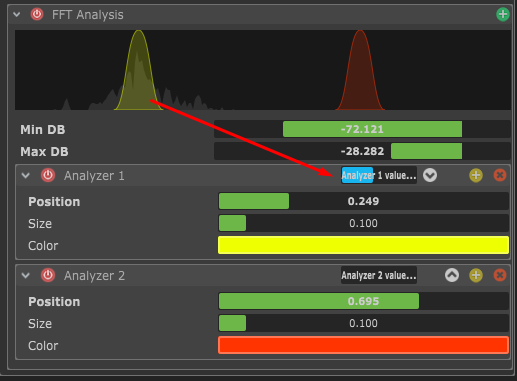

# Sound Card

Le module Sound Card te permettra de lire des sons et d'analyser un signal sonore. Il implémente une détection de pitch basique, ainsi qu'une analyses FFT pour créer des detection de volume basées sur la fréquence.


Si tu utilises un Audio Layer dans une Séquence, tu auras besoin d'un module Sound Card.



Tu peux connecter plusieurs cartes son différentes en créant plusieurs modules.



Afin d'optimiser la performance de Chataigne, les entrées audio, détection de pitch et analyse FFT sont désactivées par défaut. Si tu veux utiliser ces fonctionnalités, il faudra d'abord les activer. Mate donc la suite pour avoir plus d'infos.


## Parameters

* **Input Gain :** C'est le gain appliqué à l'entrée son. Ca affectera le volume détecté et le seuil de détéction d'activité. _Ce paramètre n'est utile que si une entrée est sélectionnée et que les channels ont été activés._ 
* **Activity Threshold :** C'est le seuil de volume à partir duquel les systèmes d'analyse vont se déclencher. Si le volume \(multiplié par le gain\) est en dessous de ce seuil, le module considère qu'il n'y a aucune activité et ne va pas traiter le signal.
* **Keep values :** Par défaut, les valeurs de pitch, note, fréquence détectées sont mises à 0 quand aucune activité n'est détectée. Activer ce paramètre permet de garder les derniers résultats de l'analyse sans remettre à 0 quand il n'y a plus de signal entrant.
* **Out volume :** C'est le volume "master", qui affectera la totalité des générateur de son de Chataigne. Il est utilisé à la toute fin de la chaîne de traitement du son. Mettre ce paramètre à 0 aura pour effet de n'avoir aucun son sortant.
* **Pitch Detection Method :** Si il n'est pas sur None, cela va activer la détection de pitch quand le volume est au-dessus de _Activity Threshold._
  * **None :** This will disable pitch detection. If you don't need it, keep it that way so it's not taking CPU.
  * **MPM :** This is a simple pitch detection method that works quite well for singing, as well as monophonic instruments. If you like reading, [there you go.](http://miracle.otago.ac.nz/tartini/papers/A_Smarter_Way_to_Find_Pitch.pdf)
  * **YIN :** This is another pitch detection method, a bit more complex and more suited to polyphonic sounds or rich in harmonics. More information [here](https://www.eecs.qmul.ac.uk/~simond/pub/2014/MauchDixon-PYIN-ICASSP2014.pdf). 
* **Monitor :** The Monitor section allows you to create a direct pass-through between the input and the output. You can tweak the volume gain, and filter out which channels to output to. 
* **FFT Analysis :** This section will allow you to create custom frequency-based volume detection. To use it, you first need to enable it by clicking on the power icon next to the "FFT Analysis" label. You can then create any number of analyzers by clicking on the green "**+**" icon on the right. Each FFT analyzer also create an "Enveloppe" value in the "FFT Enveloppes" section of the Values.

* **FFT Parameters :**
  * **Min DB / Max DB :** This is the minimum and maximum volume to detect from. Reducing the range is a good way to filter out background noise.
  * **Analyzer Position :** This is the center frequency at which this analyzer will operate.
  * **Analyzer Size :** This is the frequency range around the center at which the analyzer will operate. Higher range means more tolerant detection, but less sensitive.
  * **Color :** The UI color of the analyer, to easily find it in the analysis window.


Once you have finished your FFT setup, it's good practice to collapse the FFT panel, so less CPU is taken for drawing the FFT preview.


* **Hardware Settings :** You will find here your usual sound card settings. Again, if you want sound input, you must select a device and then select input channels to use.

