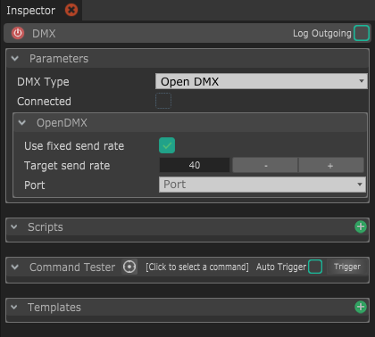
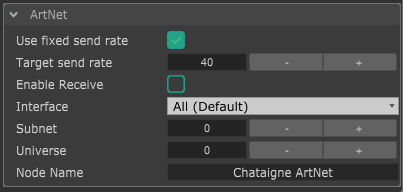

# DMX

The DMX Module allows to control DMX device such as Enttec OpenDMX, Enttec DMX Pro, Enttec DMX MkII and Artnet.

## Parameters

* **DMX Type :** This is type of DMX to use. It depends on the hardware you're using. 
* **Connected :** Whether the device is connected or not. If at least one of the devices, input or output is connected, it will be checked.

**DMX Device parameters :**

* **Use fixed send rate :** If checked, this will always send DMX data at the rate specified below
* **Target send rate :** If sending at a fixed rate, this is the rate at which to send the DMX data.
* **Enable receive \(DMXPro / Artnet only\) :** If checked, this activates receiving data.
* **Port \(OpenDMX / DMXPro only\) :** This is the port to connect the device to. 

### ArtNet specific :

* **Interface :** The network interface to use to connect to the artnet node. Depending on the OS, you will want to test different options, leaving it to All \(Default\) will probably work though.
* **Subnet :** The subnet to send the data to.
* **Universe :** The DMX universe to send the data to.
* **Node Name :** The name of the Artnet receiver node that will be shown in other softwares \(if _Enable received_ is checked\).


ArtNet may have some problems on some platforms, if you have any knowledge in implementing this protocol in C++, please contact me !


