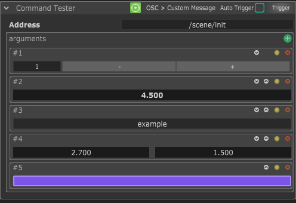

# OSC

Le module OSC Module peut recevoir n'importe quel message  OSC et le convertir en "Values". Il peut aussi envoyer des messages OSC à une ou plusieurs destinations.

## Parameters

* **Auto-Add :** Cette option active l'ajout automatique de "Values" quand un message OSC est réceptionné. Garde-le activé tant que tu veux recevoir des nouveaux types de messages, et désactives le quand tu ne veux plus créer de nouvelles values automatiquement.
* **Split Arguments :** Une fois activé, les messages OSC comportants plusieurs arguments créeront automatiquement une value différente par arguments, le nom de la value aura un numéro 0,1,2... ajouté à la fin de l'adresse OSC.
* **Auto Feedback :** Une fois activé, une message OSC sera envoyé à chaque fois qu'une Value sera modifiée. C'est pratique pour tester l'envoie rapide de values, ou avoir un synchronisation bi-directionnelle des données.
* **OSC Input :** La section OSC Input gère les paramètres de réception de l'OSC. Si ton module n'a pas vocation à recevoir des messages, mais uniquement envoyer, alors je te conseille de désactiver cette section \(avec le bouton rouge à gauche du titre\). Dans la liste des modules dans le panel "Modules", tu verras que l'icône "Incoming Data" deviendra cachée au moment de désactiver la réception.
  * **Local Port :** C'est le port sur lequel ton logiciel externe va envoyer les messages OSC.
* **OSC Outputs :** La section OSC Outputs gère les paramètres d'envoi des messages OSC.  Si ton module n'a pas vocation à envoyer des messages, mais uniquement recevoir, alors je te conseille de désactiver cette section \(avec le bouton rouge à gauche du titre\). Dans la liste des modules dans le panel "Modules", tu verras que l'icône "Outgoing Data" deviendra cachée au moment de désactiver l'envoi.

   Tu peux créer autant d'Output que tu veux, chaque Output enverra exactement les même données au même moment au déclenchement d'une commande.

  * **Local :** Cela permet de forcer l'envoi sur le même ordinateur et ne pas utiliser le champs "Remote Host". Pratique pour basculer rapidement entre un contrôle d'ordinateur à distance ou en local.
  * **Remote host :** C'est l'adresse IP de l'ordinateur à qui tu envoies les messages OSC. Tu dois désactiver "Local" pour pouvoir utiliser ce paramètres.
  * **Remote port :** Le port sur lequel envoyer les messages.
  * **Auto detect:** Cette option \(en haut à droite dans l'en-tête de la section\) est pratique pour détecter les logiciels capables de recevoir de l'OSC sur le réseau, et assigner automatiquement bon paramètres pour ce logiciel. Il est possible que cette option ne marche pas, surtout si tu n'as pas le service d'impression "Bonjour" d'Apple installé.

* **Pass-through :** Cette section te permet de faire un transfert direct des données entrantes **non-filtrées** de ce module vers un autre module OSC. Comme cette partie est en transfert direct, elle est optimisée pour être le plus rapide possible, et ne rentre pas du tout dans le système de gestion des données de Chataigne.

### Commands

Le module OSC  étant générique, il n'y a pas de commandes pré-existantes. Tu peux et dois créer tes propres commandes à partir de la "Custom command".

Tu peux ensuite choisir l'adresse OSC et ajouter des arguments OSC avec l'icône "**+**" verte.

