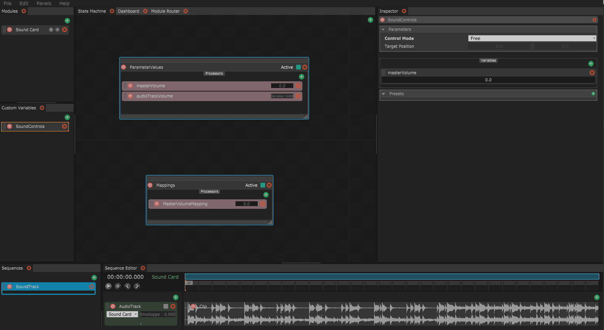

# Filter Scripts

Les scripts peuvent être utilisés comme filtre dans un mapping.


Les scripts de filtres sont utiles pour ajouter des fonctions mathématiques ou une logique de filtrage avancée à vos mappages.

## Fonctions de filtrage spécifiques <a id="condition-specific-methods-the-local-object"></a>

Lorsque des scripts sont exécutés en tant que filtre, des rappels de nouvelles fonctions sont appelés pour traiter le filtre.

<table>
  <thead>
    <tr>
      <th style="text-align:left">M&#xE9;thode</th>
      <th style="text-align:left">Description</th>
      <th style="text-align:left">Exemple</th>
    </tr>
  </thead>
  <tbody>
    <tr>
      <td style="text-align:left"><b>function filter(</b><em>inputValue, min, max</em><b>)</b>
      </td>
      <td style="text-align:left">
        <p>Cette fonction est appel&#xE9;e &#xE0; chaque fois que la cartographie
          est trait&#xE9;e et passe par la cha&#xEE;ne de filtrage.</p>
        <p><em><b>inputValue</b></em> est la valeur de l&apos;entr&#xE9;e ou de la
          pr&#xE9;c&#xE9;dente filtre.</p>
        <p><em><b>min</b></em> et <em><b>max</b></em> sont les plages de la <em><b>inputValue</b></em>,
          le cas &#xE9;ch&#xE9;ant. It&apos;s utile pour filtrer la valeur en tant
          que ou pour &#xE9;viter de d&#xE9;passer les valeurs.
          <br />
        </p>
        <p><b>Cette fonction doit retourner une valeur !</b>
        </p>
      </td>
      <td style="text-align:left"><code>fonction filtre(inputValue, min, max)<br />{<br />var result = inputValue * myFloatParam.get();<br />return result;<br />}</code>
      </td>
    </tr>
  </tbody>
</table>

Dans cet exemple, nous considérons un projet simple avec une piste audio en boucle. Nous avons également une variable personnalisée masterVolume qui contrôle le volume de la piste audio par le biais d'un mapping.



Nous aimerions maintenant ajouter la possibilité de faire un fondu enchaîné de notre piste audio. Nous pouvons le faire en utilisant des séquences qui contrôlent directement le volume de la piste audio. Cependant, afin de respecter la valeur actuelle du masterVolume, la sortie de ces séquences doit être redirigée de \[0 ; 1\] à \[0 ; masterVolume\].

Cela peut être fait avec un simple script de filtrage en multipliant la valeur de sortie des mappages des séquences de fondu par la valeur du masterVolume. Nous créons le script MultiplyByMasterVolume.js suivant :

```javascript
function filter(inputValue, min, max)
{
    return inputValue*root.customVariables.soundControls.variables.masterVolume.masterVolume.get();
}
```

Ce script de filtrage renvoie la valeur d'entrée _**inputValue**_, multipliée par la variable personnalisée masterVolume.

Rappel : Vous pouvez obtenir rapidement l'adresse du script de toute variable dans Chataigne en faisant un clic droit dessus et en sélectionnant **Copy Script Control Address**, puis vous pouvez utiliser la fonction get\(\) pour obtenir la valeur actuelle de cette variable dans un script.

Il suffit d'assigner ce script comme script de filtrage dans nos mappages de séquences de fondu pour obtenir ce que nous voulons : des séquences de fondu qui s'effacent entre 0 et la valeur actuelle de _masterVolume_.


