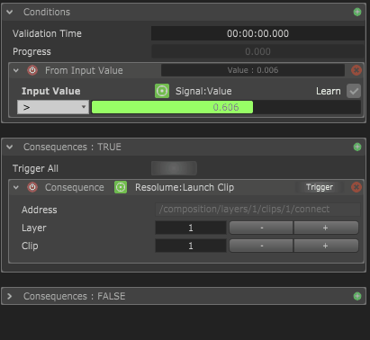

# Actions

Les actions sont des déclencheurs conditionnels "ponctuels". Vous voudrez les utiliser si vous avez un scénario "si", comme "**Si** le volume du microphone est supérieur à 50%, **alors** lancez une vidéo dans Resolume".

## Conditions

Les conditions sont la partie "**si**" de votre action. Vous pouvez avoir plusieurs conditions simultanées. Chaque fois que les conditions sont validées, l'action est déclenchée.

Il existe 5 types de conditions : From Input value, Scripts, Group, On Activate et On Deactivate

* La condition "**From Input Value**" est la plus utilisée. Il vous permettra de comparer la valeur d'entrée d'un module de différentes manières et de décider si la condition est validée ou non. 
* La **Condition Script** vous permettent d'écrire des conditions complexes à l'aide de scripts. Vous trouverez plus d'informations à ce sujet dans la section [Script Conditions](../scripting/scripting-reference/condition-scripts.md). 
* Le **Group** vous permet de créer des groupes imbriqués de conditions pour créer des combinaisons de conditions plus complexes, comme "_Si je chante un D **ET** appuyez sur ce bouton, **OU** si je chante un G **ET** j'appuie sur cet autre bouton"_
* Les conditions **onActivate** et **onDeactivate** sont déclenchées lorsque l'état qui les contient est activé ou désactivé \(non activé / désactivé). Ceci peut être utilisé pour deux scénarios :
  * Si vous souhaitez déclencher certaines actions lorsque cet état est activé, ce qui est un bon outil lorsque vous utilisez les transitions d'état, vous pouvez utiliser cette fonction pour vous assurer que vous envoyez toutes les commandes lorsque vous entrez dans un état différent de votre projet.
  * Parce que les conditions **onActivate** sont déclenchées lors du chargement d'un projet si l'état contenant est actif, il peut être utilisé comme une action d'initialisation au démarrage.

Chaque fois qu'une condition est validée, elle devient verte. Elle redeviendra grise une fois qu'elle sera invalidée.

## Conséquences

Les conséquences sont la partie "**alors**" de votre action.

* Chaque fois qu'une action est validée, elle déclenche toutes les commandes contenues dans les "**conséquences : VRAI "**. 
* Chaque fois qu'une action est invalidée, elle déclenchera toutes les commandes contenues dans la section "**Conséquences : FAUX "**.

Pour chaque action, vous pouvez créer autant de conséquences que vous le souhaitez, et elle les déclenchera toutes en même temps, ce qui permet un contrôle synchronisé des différents logiciels.

Vous avez également la possibilité de retarder le déclenchement après la validation de l'action, ainsi que d'échelonner le déclenchement de chaque conséquence, ce qui permet de déclencher chaque conséquence à intervalles réguliers.
