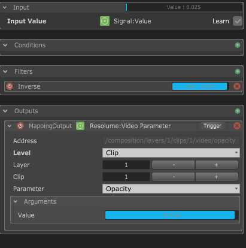

# Mappings

## Mappings

Mappings will allow you to create a continuous relationship between a module's value and the parameter of a command, like "The volume of my voice will be continuously controlling the opacity of a video"


**SHORTCUTS  
- Double-click or alt+click on the layer timeline :** Add a point  
**- Ctrl+click or right-click on a curve between 2 points :** Change the transition type.  
**- Hold shift while moving a point :** Lock X or Y value \(automatic decision depending on the mouse motion\).


### Input

You can here choose the input value you want as a source to control your commands parameters

### Filters

If you want to modify the input value before sending to to the commands, you can add filters to change the value. In the example above, i choose to inverse the input value before sending it to the output section. You can read more about filters in the Filter section

### Outputs

Outputs are the commands you want to send each time the value has changed. Commands will automatically lock one of their parameter to the output value of this mapping, except for custom commands on which you can choose yourseul which parameters to lock.

