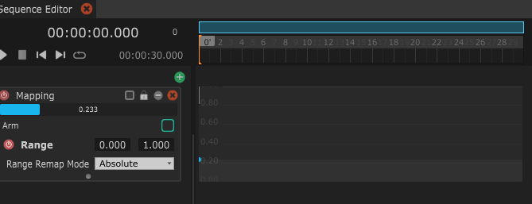

# The Ultimate Cheat Sheet

## Common shortcuts

<table>
  <thead>
    <tr>
      <th style="text-align:left">Shortcut</th>
      <th style="text-align:left">Description</th>
    </tr>
  </thead>
  <tbody>
    <tr>
      <td style="text-align:left">(Ctrl or &#x2318;) + N</td>
      <td style="text-align:left">Creates a new file</td>
    </tr>
    <tr>
      <td style="text-align:left">(Ctrl or &#x2318;) + O</td>
      <td style="text-align:left">Opens a file</td>
    </tr>
    <tr>
      <td style="text-align:left">(Ctrl or &#x2318;) + Shift + O</td>
      <td style="text-align:left">Opens the last opened file</td>
    </tr>
    <tr>
      <td style="text-align:left">(Ctrl or &#x2318;) + S</td>
      <td style="text-align:left">Saves the current file</td>
    </tr>
    <tr>
      <td style="text-align:left">(Ctrl or &#x2318;) + Shift + S</td>
      <td style="text-align:left">Saves the current file as a new file (Save as...)</td>
    </tr>
    <tr>
      <td style="text-align:left">(Ctrl or &#x2318;) + ;</td>
      <td style="text-align:left">Edit Preferences (in the Inspector)</td>
    </tr>
    <tr>
      <td style="text-align:left">(Ctrl or &#x2318;) + ,</td>
      <td style="text-align:left">Edit Project Settings (saved in the file)</td>
    </tr>
    <tr>
      <td style="text-align:left">(Ctrl or &#x2318;) + C</td>
      <td style="text-align:left">Copies the current selection</td>
    </tr>
    <tr>
      <td style="text-align:left">(Ctrl or &#x2318;) + V</td>
      <td style="text-align:left">Paste the current selection
         This will only work when pasting items of the same type.</td>
    </tr>
    <tr>
      <td style="text-align:left">(Ctrl or &#x2318;) + X</td>
      <td style="text-align:left">Copies the current selection</td>
    </tr>
    <tr>
      <td style="text-align:left">(Ctrl or &#x2318;) + D</td>
      <td style="text-align:left">Duplicates the current selection</td>
    </tr>
    <tr>
      <td style="text-align:left">Alt + O</td>
      <td style="text-align:left">
        
Import a LiLNut file and add all the content of this file to the existing
          one.

        
Content can be Modules, States, Custom Variables,
           Module Router and Sequences

      </td>
    </tr>
    <tr>
      <td style="text-align:left">Alt + S</td>
      <td style="text-align:left">
        
Exports the current selection to a LilNut file.

        
Content can be Modules, States, Custom Variables,
           Module Router and Sequences

      </td>
    </tr>
    <tr>
      <td style="text-align:left">(Ctrl or &#x2318;) + Select an Item</td>
      <td style="text-align:left">Toggles an item&apos;s selection state</td>
    </tr>
    <tr>
      <td style="text-align:left">Shift + Select an Item</td>
      <td style="text-align:left">Select all elements up to this one</td>
    </tr>
  </tbody>
</table>

## Inspector shortcuts

| Shortcut | Description |
| :--- | :--- |
| Shift + Click on a Container header | Toggle children collapsed |

| Shortcut | Description |
| :--- | :--- |
| On a Slider or number label |  |
| Alt + Drag | Decreases the sensitivity of the drag |
| Shift + Drag | Increases the sensitivity of the drag |

## State Machine shortcuts

<table>
  <thead>
    <tr>
      <th style="text-align:left">Shortcut</th>
      <th style="text-align:left">Description</th>
    </tr>
  </thead>
  <tbody>
    <tr>
      <td style="text-align:left">
        
Mouse middle
           button drag

        
or Alt + drag

      </td>
      <td style="text-align:left">Navigate in the State Machine View</td>
    </tr>
    <tr>
      <td style="text-align:left">F</td>
      <td style="text-align:left">Frame the view to the center of all States</td>
    </tr>
    <tr>
      <td style="text-align:left">H</td>
      <td style="text-align:left">Home to the absolute center of the view.</td>
    </tr>
    <tr>
      <td style="text-align:left">Mouse wheel</td>
      <td style="text-align:left">
        
Scrolls up and down (might change

        
in the future)

      </td>
    </tr>
    <tr>
      <td style="text-align:left">Shift + Mouse wheel</td>
      <td style="text-align:left">Zoom in / out</td>
    </tr>
    <tr>
      <td style="text-align:left">Shift + Enter in a comment</td>
      <td style="text-align:left">Add a new line</td>
    </tr>
  </tbody>
</table>

## Time Machine shortcuts

### Timeline Manipulation

<table>
  <thead>
    <tr>
      <th style="text-align:left">Shortcut</th>
      <th style="text-align:left">Description</th>
    </tr>
  </thead>
  <tbody>
    <tr>
      <td style="text-align:left">Drag the blue bar
         horizontal / vertical</td>
      <td style="text-align:left">
        

        
Zoom in/out and change the time focus frame

      </td>
    </tr>
    <tr>
      <td style="text-align:left">Right click on the blue bar</td>
      <td style="text-align:left">Reset the view to a full view of the whole sequence</td>
    </tr>
  </tbody>
</table>

| Shortcut | Description |
| :--- | :--- |
| Double-click on the timeline numbers | Create a Time Cue |

### Mapping Layer \(and Mapping 2D\)

| Shortcut | Description |
| :--- | :--- |
| Double click  on empty space | Create a new key at that position |
| Double click on curve | Adds a point,  keeping the overall shape intact |
| Shift + drag a key | Keep key's value, only move position |
| Alt + drag a key | Keep key's position, only move value |
| \(Ctrl or ⌘\) + click on curve | Change the curve easing type |
| \(Ctrl or ⌘\) + shift + drag | Manually draw the curve |

### Module shortcuts

| Shortcut | Description |
| :--- | :--- |
| Drag the module into a State | Show menu to automatically use it as an input or output for Action or Mapping |

